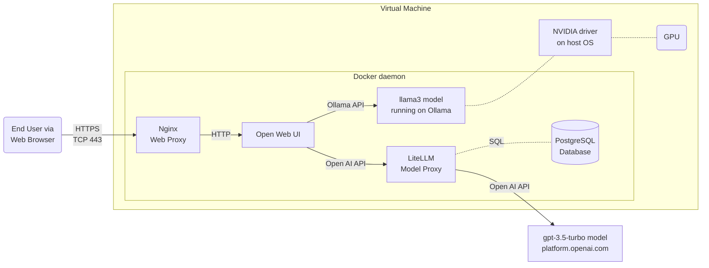

# chat-service

This project demos how to host a chat service using Open WebUI and Large Language Models (LLMs). The artifact is a Docker compose file that orchestrates the required components in Docker daemon running on any supported operating system. 

The Docker compose file supports two profiles: `local-model` and `remote-model`, as distinguished in the table below:


|  | local-model  | remote-model |
|---------|-------------|--------------|
| Language Model | A llama3 model locally managed by Ollama | A GPT-3.5-Turbo model remotely hosted by Open AI platform |
| API Spec | Ollama API | Open AI API |
| Host Requirement | A server with NVIDIA GPU | Any commodity grade device  |

Should the hosting environment supports, we can run with both profiles providing models from multiple sources for the end users to choose from. In this scenario, the architecture is illustrated as below:


Disclaimer: this demo project isn't production ready. For professional deployment service, contact author [Digi Hunch](https://www.digihunch.com/). Each section below is tagged with  or , or both to indicate which profile they are applicable to.


## Configure a Virtual Machine with GPU 

Running local model requires a server with GPU, be it a bare metal or virtual machine. In this project, we use an EC2 instance, a cloud virtual machine (VM) from Amazon Web Service. Without a GPU, the model would be unbearably slow.

The VM should be reachable from the Internet (to host the website), and should be able to connect to the Internet (for downloading Docker images, models, etc). The VM should also have sufficient disk space to download a model. Let's make the root device 100G. A good option for this demo is the `g4dn.xlarge` instance type, which comes with a single GPU (NVIDIA T4). For OS, we use an AMI with Ubuntu 24.04 OS. I use the following AWS CLI command to find out such AMIs in a given region and pick the latest:

```sh
aws ec2 describe-images --owners amazon --filters "Name=name,Values=ubuntu/images/hvm-ssd-gp3/ubuntu-noble-24.04-amd64-server-*" --query 'Images[].{ImageId:ImageId, Name:Name}|sort_by(@,&Name)' --output table --region us-east-1
```

I picked AMI ID `ami-04b70fa74e45c3917` for region `us-east-1` my testing. On top of the VM, we host the application in Docker container because it saves a lot of efforts troubleshooting dependencies and provides better portability. With these AMIs the default Linux user is `ubuntu`.

## Install Docker Compose  

To install Docker community edition, follow the [official guide](https://docs.docker.com/engine/install/) and locate the section relevant to your OS. To verify that the Docker compose plugin has been installed, run the following command and it should return the version:
```sh
docker compose version
> Docker Compose version v2.27.1
```
We need the Docker Compose version greater than 2.20 to leverage some of its latest features.
Note: if you're testing on a Linux VM, we do need we need `root` privilege to start Docker daemon and run CLI commands to interact with the daemon. For this sake, the docker commands in the rest of this instruction all has `sudo` at the beginning. If you're running these commands from MacBook or other OS, `sudo` may not be required.


## Install NVIDIA driver 

To install NVIDIA driver on the VM, run the following command:
```sh
sudo apt update
sudo apt install nvidia-driver-550 nvidia-dkms-550
```

In the command, 550 is the driver branch but the specific command may vary depending on the date it is run. Check out the `Manual driver installation` section on [this guide](https://ubuntu.com/server/docs/nvidia-drivers-installation) to figure out the correct command for the current date.

After installation, run `sudo nvidia-smi` command, which should return the driver version and CUDA version:
```sh
+-----------------------------------------------------------------------------------------+
| NVIDIA-SMI 550.90.07              Driver Version: 550.90.07      CUDA Version: 12.4     |
|-----------------------------------------+------------------------+----------------------+
| GPU  Name                 Persistence-M | Bus-Id          Disp.A | Volatile Uncorr. ECC |
| Fan  Temp   Perf          Pwr:Usage/Cap |           Memory-Usage | GPU-Util  Compute M. |
|                                         |                        |               MIG M. |
|=========================================+========================+======================|
|   0  Tesla T4                       Off |   00000000:00:1E.0 Off |                    0 |
| N/A   42C    P0             25W /   70W |       1MiB /  15360MiB |      8%      Default |
|                                         |                        |                  N/A |
+-----------------------------------------+------------------------+----------------------+

+-----------------------------------------------------------------------------------------+
| Processes:                                                                              |
|  GPU   GI   CI        PID   Type   Process name                              GPU Memory |
|        ID   ID                                                               Usage      |
|=========================================================================================|
|  No running processes found                                                             |
+-----------------------------------------------------------------------------------------+
```

In addition to the driver, let's also install `nvidia-container-toolkit` following the [instruction](https://docs.nvidia.com/datacenter/cloud-native/container-toolkit/latest/install-guide.html#installing-with-apt) to install with apt. Then configure the runtime and restart Docker daemon:

```sh
sudo nvidia-ctk runtime configure --runtime=docker

sudo systemctl restart docker
```
Note if you do not perform this step, you will come across this error when trying to bring up the model from docker:
`could not select device driver "nvidia" with capabilities: [[gpu]]`

## Configure Compose Profile  

Let's download the files in this repository and enter the directory to edit the environment variable file `.env`:
```sh
cd ~
git clone https://github.com/digihunch/chat-service.git
cd chat-service
vim .env
```
The value of `COMPOSE_PROFILES` should be the profiles, based on how you would like to source the models. The value can be `local-model`, `remote-model` or `local-model,remote-model` to use both profiles. The value of `ENABLE_OLLAMA_LOCAL_MODEL` should be `True` if `local-model` is used in `COMPOSE_PROFILES`.

## Configure Model 

To configure access to `gpt-3.5-turbo` model hosted remotely on platform.openai.com, you must have an [OpenAI](https://platform.openai.com/) account and an [API key](https://help.openai.com/en/articles/4936850-where-do-i-find-my-openai-api-key). Get an OpenAI API key from OpenAI use it as the value for variable `REMOTE_OPENAI_API_KEY` in the file `.env` to tell the LiteLLM proxy how to connect to the remote model. We also set the value of `LITELLM_MASTER_KEY` to a value that we desire. With that, we can provision another key for Open Web UI to connect to LiteLLM. To do so, first, we launch the `litellm-proxy-svc` service: 

```sh
sudo docker compose up litellm-proxy-svc
```
Then can fire the following request using `curl` from another terminal session:
```sh
curl 'http://0.0.0.0:4000/key/generate' \
--header 'Authorization: Bearer sk-liteLLM1234' \
--header 'Content-Type: application/json' \
--data-raw '{"models": ["gpt-3.5-turbo"], "metadata": {"user": "user@digihunch.com"}}'
```
In the response, one of the attribute is `key`, with the value starting with `sk-`. Use this value as the value for `LITELLM_OPENAI_API_KEY` in the environment variable file `.env`.


## Configure Model 

To configure the llama3 model, let's start the `ollama-svc` service:
```sh
sudo docker compose up ollama-svc
```
Once the service is started, we can pull `llama3 model`, by running `ollama` client from the container. Start a new terminal session and run:
```sh
sudo docker exec -it ollama ollama pull llama3
sudo docker exec -it ollama ollama list
```
The second command verifies that the model is available locally. 

## Start the Web Server  
Before launching the web site, we need to create a demo certificate. Suppose the site name is `chatsample.digihunch.com`, and the work directory is `/home/ubuntu/chat-service`. Run the following `openssl` command:
```sh
openssl req -x509 -sha256 -newkey rsa:4096 -days 365 -nodes -subj /C=CA/ST=Ontario/L=Waterloo/O=Digihunch/OU=Development/CN=chatsample.digihunch.com/emailAddress=chatsample@digihunch.com -keyout /home/ubuntu/chat-service/nginx/certs/hostname-domain.key -out /home/ubuntu/chat-service/nginx/certs/hostname-domain.crt
```
This command creates the `hostname-domain.key` and `hostname-domain.crt` file in the `/home/ubuntu/chat-service/nginx/certs/` directory, which are referenced by relative path in the configuration in `nginx.conf` file included in the repo.

Then we can (re)start docker compose to reflect the changes to litellm and nginx config:

```sh
sudo docker compose up
```
If all services start correctly, the web service is listening on port 443. If your service is running your MacBook, you can hit the port 443 directly from a browser. If your service is running on a VM, you can hit the server on public IP at port 443. Alternatively, if your have SSH access to the VM, you can map the server's 443 port to your laptop's 8443 port with port forwarding:
```bash
ssh ubuntu@i-0ebba94b69620677e -L 8443:localhost:443
```
Then hit port 8443 from your browser to visit the site. 

Sign up and enjoy the chat.

## Troubleshooting

For more troubleshooting details, refer to my blog post.
